<!-- <h1 align="center">Hi there, I'm Felix </h1> -->

<pre align="center">
<strong>Felix Soubelet</strong> / <a href="https://fsoubelet.github.io">Homepage</a> / <a href="https://orcid.org/0000-0001-8012-1440">ORCID</a> / <a href="https://github.com/fsoubelet">GitHub</a> / <a href="https://gist.github.com/fsoubelet">Gist</a> / <a href="https://twitter.com/Felix_Fly">Twitter</a>
</pre>

<a href="https://metrics.lecoq.io/about/fsoubelet"></img></a>
<a href="https://metrics.lecoq.io/about/fsoubelet"></img></a>

I'm a postdoctoral fellow in particle accelerator physics working [@CERN][cern] on optics and incoherent effects modeling, namely Intra-Beam Scattering.
My work mostly includes some maths, computational physics, simulations, machine measurements and data analysis.
I am a privacy & Open Source advocate, as well as a [Python][python] enthusiast, interested in scientific outreach, programming, photography and most kinds of tinkering.

<!--   -->

<!-- A Little About Me -->

## What I'm up to

- 📚 I recently finished my PhD on **IR Local Coupling Correction** for the [Large Hadron Collider][lhc] through novel methods;
- 👨‍🔬 I'm currently working on incoherent effects modeling for the CERN injectors, mainly **Intra-Beam Scattering**;
- 👨‍💻 I contribute to the development of [OMC][pylhc] codes and the [xsuite][xsuite] ecosystem;
- 🏃 I'm interested in making codes run faster, I mostly make codes run;
- 🌱 I’m currently trying to find time to learn `Nim` and `SQL`;
- 💬 I'm always happy to answer questions and contribute to projects;
- 📫 I can be reached at <felix.soubelet@cern.ch>.

<!-- My Codes -->

<!-- ## Used Accelerator Physics Codes

|         Design and Tracking          |    Collective Effects    | Optics Studies & Analysis  |
| :----------------------------------: | :----------------------: | :------------------------: |
| [Methodical Accelerator Design][mad] | [PyHEADTAIL][pyheadtail] | [PyhDToolkit][pyhdtoolkit] |
|           [xtrack][xtrack]           |    [xfields][xfields]    |        [omc3][omc3]        |
|   [Polymorphic Tracking Code][ptc]   |   [PyECLOUD][pyecloud]   | [cpymadtools][cpymadtools] | -->

<!-- <strong>Design and Tracking Codes</strong>
- [Methodical Accelerator Design][mad]
- [Polymorphic Tracking Code][ptc]
- [SixTrack / SixTrackLib](https://github.com/SixTrack)
- [xsuite / xtrack][xsuite]

<strong>Collective Effects</strong>
- [PyHEADTAIL][pyheadtail]
- [PyECLOUD][pyecloud]

<strong>Optics Studies & Analysis</strong>
- [PyhDToolkit][pyhdtoolkit]
- [cpymadtools][cpymadtools]
- [optics_functions](https://github.com/pylhc/optics_functions)
- [omc3][omc3] -->

<!-- My GitHub Stats ❤️ -->

<!-- ## Languages, Tools and Statistics

<h1 align="center">

 

 

<a href="https://metrics.lecoq.io/about/fsoubelet"></img></a> -->

[cern]: https://home.cern/
<!-- [cpymadtools]: https://github.com/beamopticsanalysis/cpymadtools -->
[lhc]: https://home.cern/science/accelerators/large-hadron-collider
<!-- [mad]: https://mad.web.cern.ch/mad/ -->
<!-- [omc3]: https://github.com/pylhc/omc3 -->
<!-- [ptc]: http://madx.web.cern.ch/madx/doc/PTC_reference_manual.pdf -->
<!-- [pyecloud]: https://github.com/PyCOMPLETE/PyECLOUD -->
<!-- [pyhdtoolkit]: https://github.com/fsoubelet/PyhDToolkit -->
<!-- [pyheadtail]: https://github.com/PyCOMPLETE/PyHEADTAIL -->
[pylhc]: https://github.com/pylhc
[python]: https://www.python.org/
<!-- [xfields]: https://github.com/xsuite/xfields -->
[xsuite]: https://github.com/xsuite
<!-- [xtrack]: https://github.com/xsuite/xtrack -->
